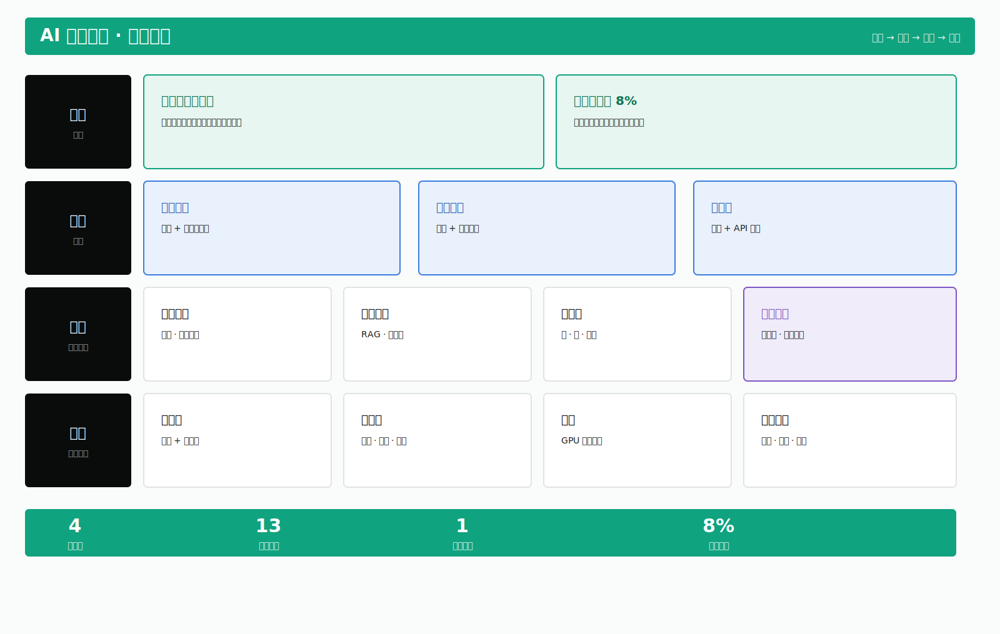
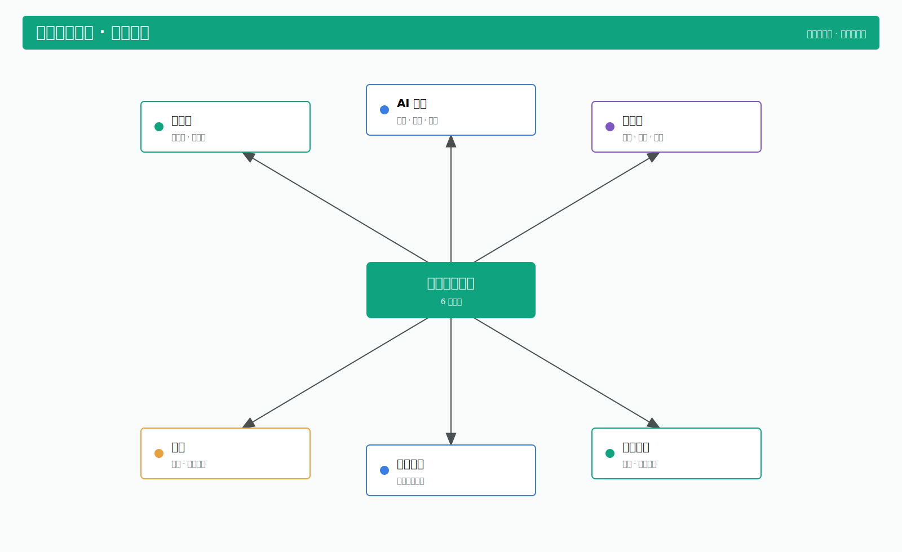
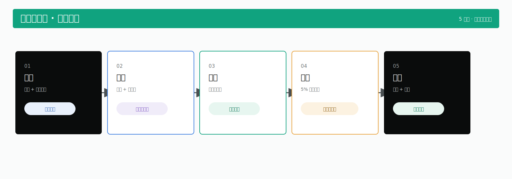
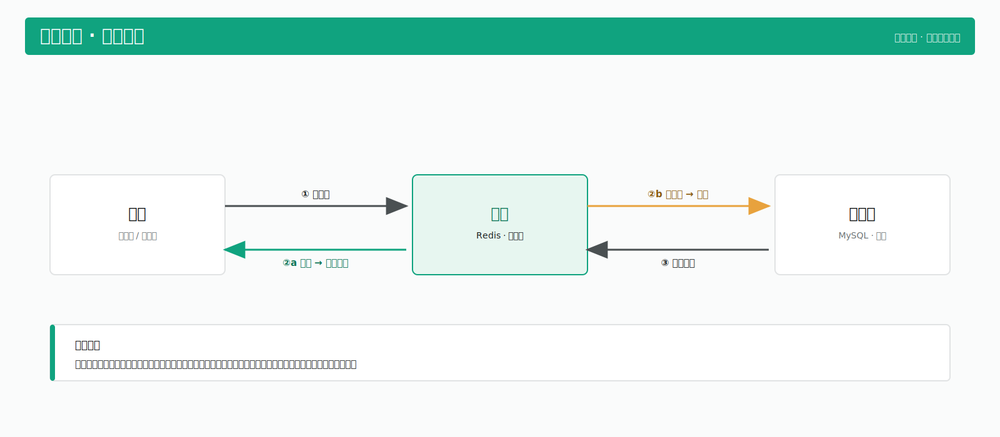

# feishu-whiteboard-geist

一个 **Claude Code skill**：把一段想法/内容，按 **Geist 绿白**工作图表规范，自动选合适的画板范式（全景 / 骨架 / 路线 / 机制），产出 SVG → 渲染回看修 → 推成一张**飞书可编辑画板**，最后给文档链接 + 渲染图。

这是工作型图表（汇报 / 脑暴 / 共创）的默认通道，强制走 Geist 绿白单一规范——不是 35 色板自由选择那套。

## 架构：两层

- **引擎层 = [`beautiful-feishu-whiteboard`](https://github.com/zarazhangrui/beautiful-feishu-whiteboard)**（zarazhangrui 的独立开源 skill）：负责飞书 SVG 画板的介质硬规则 + 渲染/推送命令，是真正把 SVG 变成飞书可编辑画板的那套。
- **约束层 = 本 skill**：在引擎之上加一层 **Geist 绿白**规范 + 范式选择，让产出的是克制、好看、一致的工作图表。

> 所以本 skill **不能单独跑**，必须先装引擎 skill + `lark-cli`。

## 四种范式（带示意图）

“好看”的本质是约束：90% 中性灰阶 + 唯一一个绿做强调；边框优先于阴影；语义上色不是装饰上色。下面四张都是本 skill 按 Geist 规范生成的示意（SVG 源文件在 [`assets/`](assets)）。

### 全景图 — 一个体系的全貌、分层结构
分层铺（地基 → 支柱 → 运营 → 终局），每块按四档状态上色，底部放绿色硬数据条。



### 骨架图 — 讨论锚点、只到模块层
中枢（绿）+ 主干（分类色）的浅层导图，只到模块层、不画细节。



### 路线图 — 阶段推进、分场流程
横向阶段卡片流，首尾中性深、中段分类色，产出用语义 tag。



### 机制图 — 一个机制怎么运转
左右对照 + marker 箭头，突出运转逻辑（命中走绿快路径、未命中走琥珀）。



## 依赖

1. **引擎 skill**：[`beautiful-feishu-whiteboard`](https://github.com/zarazhangrui/beautiful-feishu-whiteboard)（装到 `~/.claude/skills/`）
2. [`lark-cli`](https://www.npmjs.com/package/@larksuite/cli)（npm `@larksuite/cli`）——已装且已登录
3. `@larksuite/whiteboard-cli`（走 `npx` 自动下载，无需预装）
4. 一个飞书 / Lark 账号

## 安装

```bash
# 0. 先装引擎 skill（如已装可跳过）
git clone https://github.com/zarazhangrui/beautiful-feishu-whiteboard.git \
  ~/.claude/skills/beautiful-feishu-whiteboard

# 1. 拉本仓
git clone https://github.com/xueuncia-product/feishu-whiteboard-geist.git
cd feishu-whiteboard-geist

# 2. skill 本体 + 换肤脚本
mkdir -p ~/.claude/skills/feishu-whiteboard-geist
cp SKILL.md ~/.claude/skills/feishu-whiteboard-geist/SKILL.md
cp -r scripts ~/.claude/skills/feishu-whiteboard-geist/scripts

# 3. Geist 设计规范（skill 正文引用 ~/.claude/diagram-visual-spec.md）
cp references/diagram-visual-spec.md ~/.claude/diagram-visual-spec.md

# 4. （可选）本仓 references/RULES.md 是引擎 skill RULES.md 的副本，供离线查阅；
#     装了引擎 skill 后以 ~/.claude/skills/beautiful-feishu-whiteboard/RULES.md 为准。
```

> SKILL.md 里用的是 `~/.claude/...` 绝对路径。如果你的目录布局不同，按上面路径对应调整即可。

## 目录

```
SKILL.md                          # skill 本体
references/diagram-visual-spec.md # Geist 绿白调色板 + 视觉规范（自包含）
references/RULES.md               # 飞书 SVG 画板硬限制 + 渲染/推送命令（引擎 skill RULES.md 的副本）
scripts/recolor_geist.py          # 状态/结构型换肤：linen 配色 → Geist（含阴影删除）
scripts/recolor_geist_cat.py      # 分类型换肤（骨架/路线图的分支/分场配色）
assets/                           # 四种范式的示意图 SVG（README 里展示的那四张）
```

## 三条铁坑

1. **SVG 文字里禁 emoji**——whiteboard-cli 遇 emoji 会静默断图。
2. **导出 PNG 文字颜色不可信**（白字常变黑）——核验颜色看线上或用 `--output_as raw`。
3. **配色不要自由发挥**——只用 `diagram-visual-spec.md` 的 token。

## 致谢

引擎层基于 [zarazhangrui/beautiful-feishu-whiteboard](https://github.com/zarazhangrui/beautiful-feishu-whiteboard)。本仓只是在其上加一层 Geist 绿白约束。
