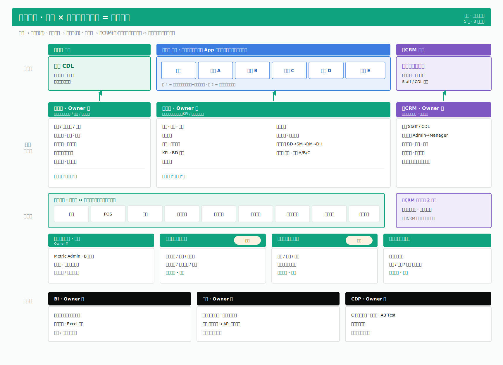
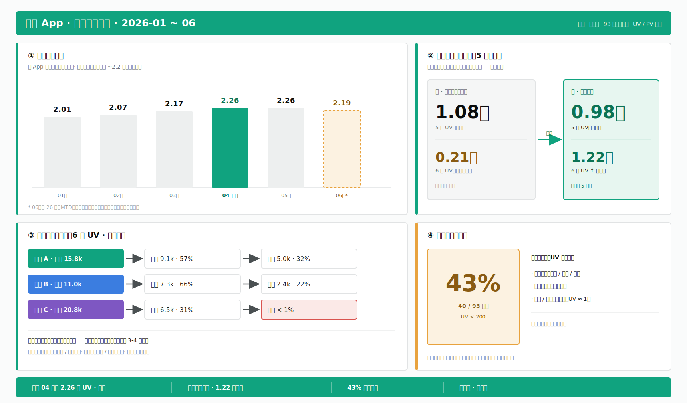
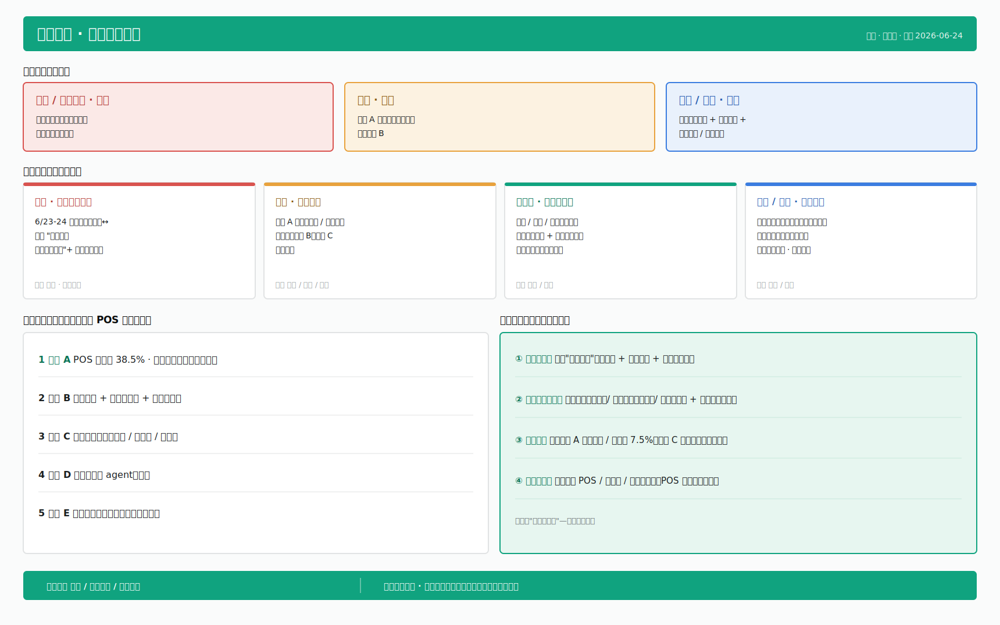
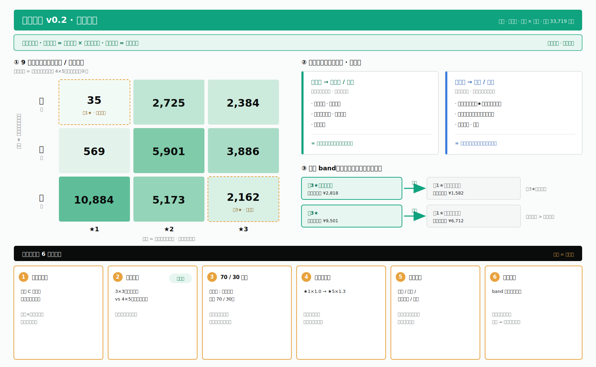

# feishu-whiteboard-geist

一个 **Claude Code skill**：把一段想法/内容，按 **Geist 绿白**工作图表规范，自动选合适的画板范式，产出 SVG → 渲染回看修 → 推成一张**飞书可编辑画板**，最后给文档链接 + 渲染图。

这是工作型图表（汇报 / 脑暴 / 共创）的默认通道，强制走 Geist 绿白单一规范——不是 35 色板自由选择那套。

## 架构：两层

- **引擎层 = [`beautiful-feishu-whiteboard`](https://github.com/zarazhangrui/beautiful-feishu-whiteboard)**（zarazhangrui 的独立开源 skill）：负责飞书 SVG 画板的介质硬规则 + 渲染/推送命令。
- **约束层 = 本 skill**：在引擎之上加一层 **Geist 绿白**规范 + 范式选择，让产出的是克制、好看、一致的工作图表。

> 本 skill **不能单独跑**，必须先装引擎 skill + `lark-cli`。

## 能画成什么样（示例 · 全虚构脱敏）

下面四张都是本 skill 按 Geist 规范生成的工作板，**数据、产品名、人名全部虚构脱敏**，仅展示密度与版式水准（SVG 源文件在 [`assets/`](assets)）。

### 架构全景 — 多业务线 × 分层平台
分层铺（业务层 → 功能模块层 → 共用底座 → 能力层 → 数据层），按业务线分类色 + owner 副标 + 密集 bullet 卡，待建项用琥珀 tag。



### 数据分析板 — 趋势 / 漏斗 / 前后对比
柱状图（峰值描重、MTD 用琥珀虚线）+ 改版前后大数字对比 + 多级下钻漏斗 + 沉默占比大数字 + 底部数据条。



### 信息周报 — 情绪基调 / 信号 / 排序 / 建议
情绪基调三档语义卡 + 四大信号（顶部色条 + 来源）+ 竞品盯防排序 + 建议速览绿框。



### 双坐标分层 — 9 宫格热力 + 决策点
9 宫格热力图（底色深浅 = 体量）+ 离群档琥珀虚线 + 两个权益域 + 越级 band + 底部 6 个待拍板决策卡。



## 四种基础范式

skill 内部按这 4 种基础范式选型，组合后即上面那类复合工作板：

| 内容形态 | 范式 |
|---|---|
| 一个体系的全貌、分层结构 | **全景图** |
| 讨论锚点、只到模块层 | **骨架图** |
| 阶段推进、分场流程 | **路线图** |
| 一个机制怎么运转 | **机制图** |

## 依赖

1. **引擎 skill**：[`beautiful-feishu-whiteboard`](https://github.com/zarazhangrui/beautiful-feishu-whiteboard)（装到 `~/.claude/skills/`）
2. [`lark-cli`](https://www.npmjs.com/package/@larksuite/cli)（npm `@larksuite/cli`）——已装且已登录
3. `@larksuite/whiteboard-cli`（走 `npx` 自动下载，无需预装）
4. 一个飞书 / Lark 账号

## 安装

```bash
# 0. 先装引擎 skill（如已装可跳过）
git clone https://github.com/zarazhangrui/beautiful-feishu-whiteboard.git \
  ~/.claude/skills/beautiful-feishu-whiteboard

# 1. 拉本仓
git clone https://github.com/xueuncia-product/feishu-whiteboard-geist.git
cd feishu-whiteboard-geist

# 2. skill 本体 + 换肤脚本
mkdir -p ~/.claude/skills/feishu-whiteboard-geist
cp SKILL.md ~/.claude/skills/feishu-whiteboard-geist/SKILL.md
cp -r scripts ~/.claude/skills/feishu-whiteboard-geist/scripts

# 3. Geist 设计规范（skill 正文引用 ~/.claude/diagram-visual-spec.md）
cp references/diagram-visual-spec.md ~/.claude/diagram-visual-spec.md

# 4. （可选）本仓 references/RULES.md 是引擎 skill RULES.md 的副本，供离线查阅。
```

> SKILL.md 里用的是 `~/.claude/...` 绝对路径。如果你的目录布局不同，按上面路径对应调整即可。

## 目录

```
SKILL.md                          # skill 本体
references/diagram-visual-spec.md # Geist 绿白调色板 + 视觉规范（自包含）
references/RULES.md               # 飞书 SVG 画板硬限制 + 渲染/推送命令（引擎 skill RULES.md 的副本）
scripts/recolor_geist.py          # 状态/结构型换肤：linen 配色 → Geist
scripts/recolor_geist_cat.py      # 分类型换肤
assets/                           # 4 张示例工作板 SVG（README 里展示的那几张，全虚构）
```

## 三条铁坑

1. **SVG 文字里禁 emoji**——whiteboard-cli 遇 emoji 会静默断图。
2. **导出 PNG 文字颜色不可信**（白字常变黑）——核验颜色看线上或用 `--output_as raw`。
3. **配色不要自由发挥**——只用 `diagram-visual-spec.md` 的 token。

## 致谢

引擎层基于 [zarazhangrui/beautiful-feishu-whiteboard](https://github.com/zarazhangrui/beautiful-feishu-whiteboard)。本仓只是在其上加一层 Geist 绿白约束。
